# BookLibrarySystem  📚

## Description 💻
- Brief Overview of
The Book System 

A Book library management system is software that is designed to manage all the functions of a library. Its sole purpose is to help users like librarians to maintain the database of new books and the books that are borrowed by members along with their dates. This system completely automates and operates all your Book library's activities to keep track of their book collection in their own desired way.

## User Manual
1)  The program welcomes you to the login page and asks you to enter 1 or 2.

*IF* you press 1 in logs into the program 
*IF* you press 2 it exits the program.
 
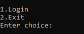  
&nbsp;

2) when you press 1 it then Asks for the username and password that is required to allow access to the Book library management. 
*IF* you enter the wrong Username and Password the program will ask you to enter it again.

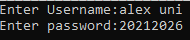  
&nbsp;

3) Once you enter the correct Credentials ,the System menu will pop up in front of you giving access to Multiple orders .

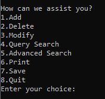  
➢ If you enter an incorrect choice, It will ask you again.

-------------------------------------

## Functionality ##

####  1-  ADD function 📝 ####
* If you enter “1” in the menu it redirects you to the add function asks for the basic book components needed to register and add the book to the library if all the validations are correct .

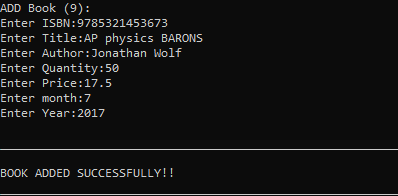

- - - - - -

1) ISBN: The International Standard Book Number that must contain 13 Digits ONLY and must not be a duplicate ISBN that already exists.
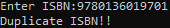 

Example:  
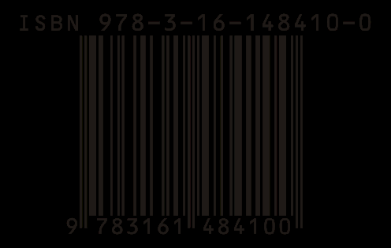 

2) Title: The name of the book that is to be added. 
3) Author: The name of the book writer. 
4) Quantity: The number of Copies you have of that book. (it shouldn’t be decimal or fraction). 
5) Price: The price of the book. 
6) Publication Date: The time of the book first release  
*Month of publication ranges from 1( January ) to 12 ( December ).  
*Year of publication ranges from 1000 to 2022.

---------------

####  2- DELETE function ❌####
1) If you enter “2” in the menu it redirects you to the Delete function which asks for the ISBN of the book you want to remove from the Library.

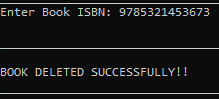 

2) If you enter a book ISBN that does not exist the library will tell you that the book was not found and will return you to the menu. 
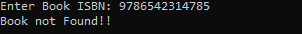

3)  If you enter book ISBN that is not in the correct form the library will tell you that the ISBN you entered is invalid and will return you to the menu. 
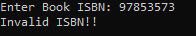

-----------------

####  3- MODIFY function 🔧####
1) If you press “3” in the menu it redirects you to the modify function, it will ask you to Enter the ISBN of the book you want to modify , then it asks you which field in that book that you want to alter. 
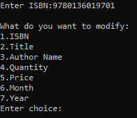

2) when you enter a number that isn't a choice ,it will ask you for the ISBN once more. 
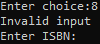

3) Once you’re done with your choice and made your modification that follows all validations, a message will appear to confirm that the book was modified, Then it directs you back to the menu. 
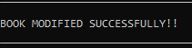

➢ if you wish to modify another field you should choose the modify function again from the menu and go through the same steps all over again.

---------------------------

####  4-QUERY SEARCH function  🪜####
1) If you enter “4” in the menu, it will ask you for the ISBN of the book that you want to search for edit will print all the information of that book. 
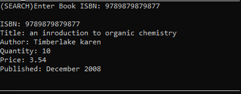

 ➢ The program will print *book not found* if the ISBN entered is not in the book library.

 -------------------------

 ####  5- ADVANCED SEARCH function 🔭 ####
 1) If you enter “5” in the menu, the program will ask you for a keyword and the system will provide and print all the data for all the books whose title contains the keyword entered and if no book contains the keyword found it will print a message *no matches are found* 
 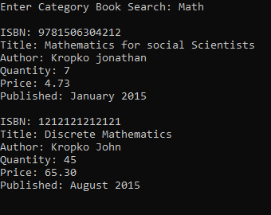

 ➢ **MAKE SURE** to enter the exact Capitalization of the word you’re searching for.

-------------------------
####  6- PRINT (Sort) function ✒️####
1) If you enter “6” in the menu, it will ask you about what do you want sort by. 
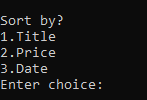

* Sort by Title:
➢ If you enter “1” the program sorts the Book library alphabetically : 
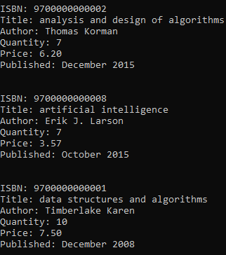

* Sort By Price:
➢ If you enter “2” the program sorts the Book library ascendingly ( from cheapest price to Most expensive price): 
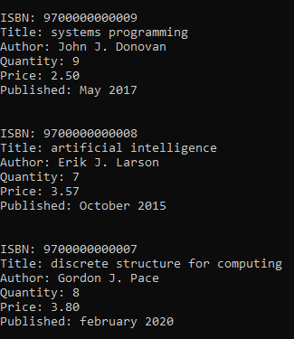

* Sort By Date:
➢ If you enter “3” the program sorts the Book library from the newest publication date to the oldest. 
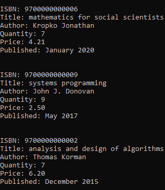

➢ If you enter any incorrect number choice the program will print *“Invalid choice”* and will ask you again.

-----------------
####  7- SAVE function 💾####
1) If you enter “7” in the menu, the changes you made to the book library will be saved successfully. 
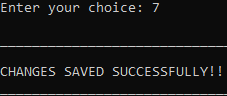

-----------------------
####  8- EXIT function 👋####
1) if you enter “8” in the menu, The program will alert you if you are willing to save before quitting or quit. 
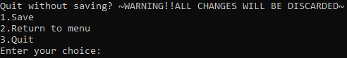

- if you enter 1 it will save and return to the menu if you want make other changes.
- If you enter 2 it will return to the menu before saving anything .
- If you enter 3 it will full exit the program and it will not save the changes.
---------------------------

&nbsp;

&nbsp;

# Algorithms Used #
**➢ LINEAR SEARRCH:**
 Linear search, also called as orderly search or sequential search, because each crucial element that is considered the search key is searched from the first element in an array, to final element in an array.
 *Linear search is used in the book library in:*
*  checking if the ISBN entered is a duplicate of another Book’s ISBN. ( Add and Modify)
*  the Delete function as the program searches for the ISBN index of book entered in order to delete its data.
*  Advanced search when looking for the keyword entered in all the books in the library.
*  Query search as the program searches for the index of the searched ISBN in order to print all the book’s data.

&nbsp;

**➢ BUBBLE SORTING:**
 Bubble Sort is the simplest sorting algorithm that works by repeatedly swapping the adjacent elements if they are in the wrong order.
* Bubble sort is used in the book library in:
* Print function when sorting the book data according to Title ascendingly
* Print function when sorting the book data according to Price from cheapest to Most expensive
* Print function when sorting the book data according to Date of publication from most recently published to latter published and so on.